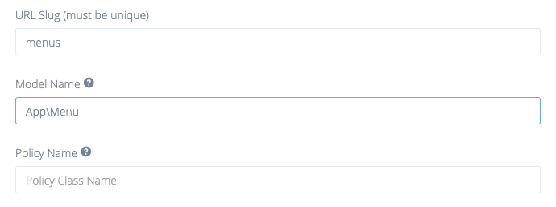

# Overriding files

## Overriding BREAD Views

You can override any of the BREAD views for a **single** BREAD by creating a new folder in `resources/views/vendor/hymer/slug-name` where _slug-name_ is the _slug_ that you have assigned for that table. There are 4 files that you can override:

* browse.blade.php
* edit-add.blade.php
* read.blade.php
* order.blade.php

Alternatively you can override the views for **all** BREADs by creating any of the above files under `resources/views/vendor/hymer/bread`

## Overriding submit button:
You can override the submit button without the need to override the whole `edit-add.blade.php` by extending the `submit-buttons` section:  
```blade
@extends('hymer::bread.edit-add')
@section('submit-buttons')
    @parent
    <button type="submit" class="btn btn-primary save">Save And Publish</button>
@endsection
```

## Using custom Controllers

You can override the controller for a single BREAD by creating a controller which extends Hymers controller, for example:

```php
<?php

namespace App\Http\Controllers;

class HymerCategoriesController extends \PickOne\Hymer\Http\Controllers\HymerBaseController
{
    //...
}
```

After that go to the BREAD-settings and fill in the Controller Name with your fully-qualified class-name:


You can now override all methods from the [HymerBaseController](https://github.com/the-control-group/hymer/blob/1.6/src/Http/Controllers/HymerBaseController.php)

## Overriding Hymers Controllers


**Only use this method if you know what you are doing**  
We don't recommend or support overriding all controllers as you won't get any code-changes made in future updates.


If you want to override any of Hymers core controllers you first have to change your config file `config/hymer.php`:

```php
/*
|--------------------------------------------------------------------------
| Controllers config
|--------------------------------------------------------------------------
|
| Here you can specify hymer controller settings
|
*/

'controllers' => [
    'namespace' => 'App\\Http\\Controllers\\Hymer',
],
```

Then run `php artisan hymer:controllers`, Hymer will now use the child controllers which will be created at `App/Http/Controllers/Hymer`

## Overriding Hymer-Models

You are also able to override Hymers models if you need to.  
To do so, you need to add the following to your AppServiceProviders register method:

```php
Hymer::useModel($name, $object);
```

Where **name** is the class-name of the model and **object** the fully-qualified name of your custom model. For example:

```php
<?php

namespace App\Providers;

use Illuminate\Support\ServiceProvider;
use Illuminate\Events\Dispatcher;
use PickOne\Hymer\Facades\Hymer;

class AppServiceProvider extends ServiceProvider
{
    public function boot()
    {
        Hymer::useModel('DataRow', \App\DataRow::class);
    }
    // ...
}
```

The next step is to create your model and make it extend the original model. In case of `DataRow`:

```php
<?php

namespace App;

class DataRow extends \PickOne\Hymer\Models\DataRow
{
    // ...
}
```

If the model you are overriding has an associated BREAD, go to the BREAD settings for the model you are overriding
and replace the Model Name with your fully-qualified class-name. For example, if you are overriding the Hymer `Menu`
model with your own `App\Menu` model:



